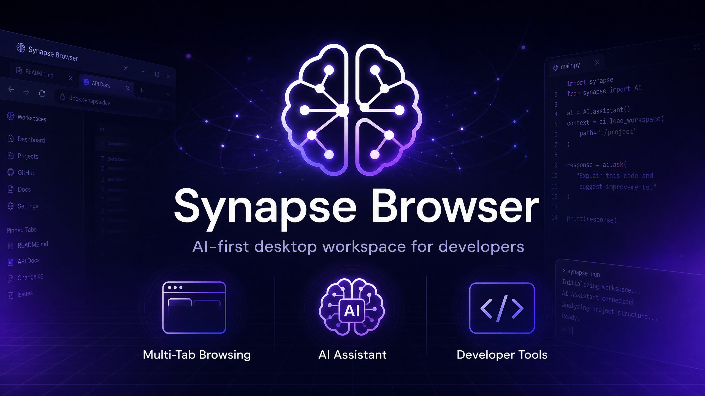
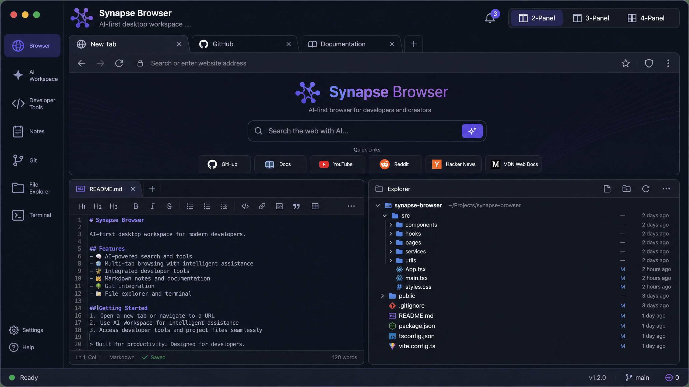
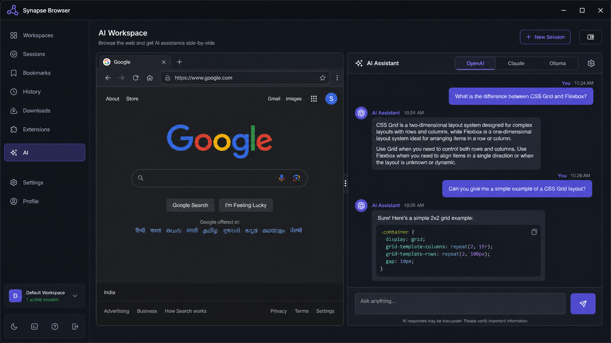
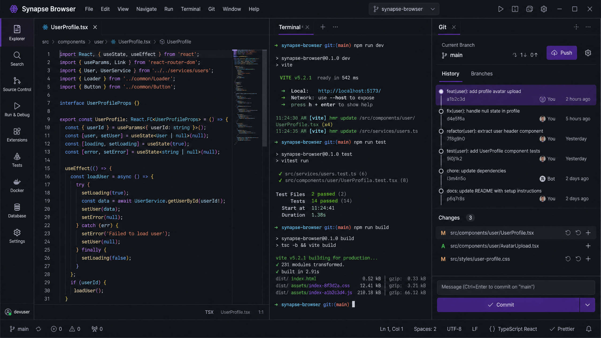
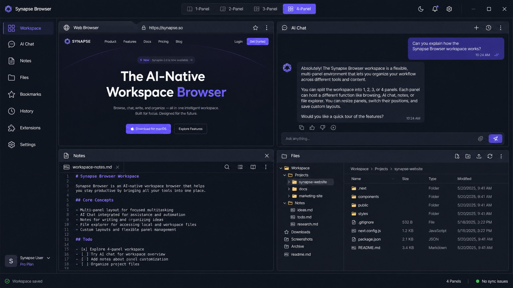
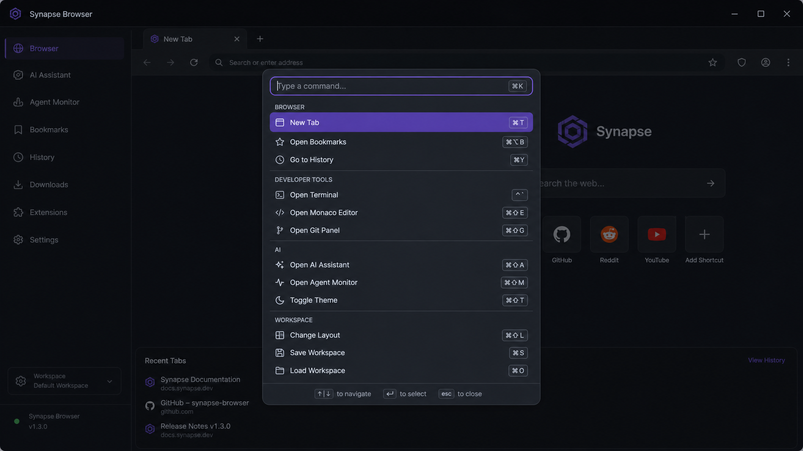
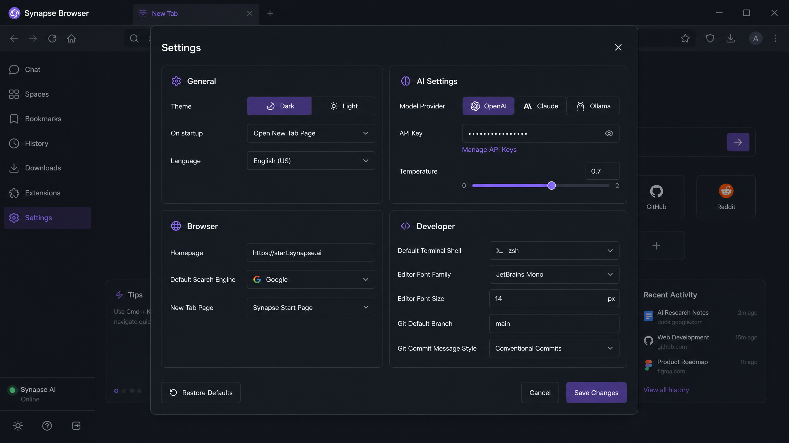
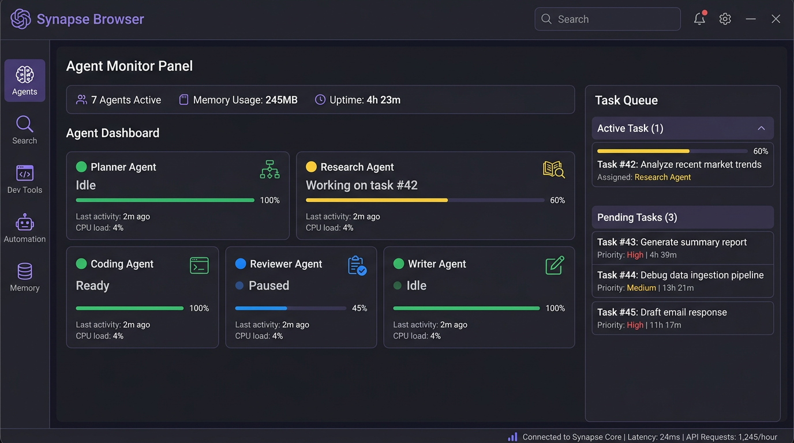
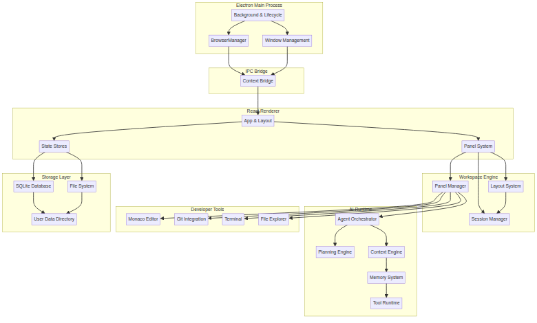

<p align="center">
  
</p>

<h1 align="center">Synapse Browser</h1>

<p align="center">
  An AI-first desktop workspace that combines web browsing, AI assistants, project management, developer tools, Git integration, notes, and autonomous agents into a unified productivity environment.
</p>

<p align="center">
  <a href="#key-features">Features</a> |
  <a href="#why-synapse">Why Synapse</a> |
  <a href="#architecture">Architecture</a> |
  <a href="#installation">Installation</a> |
  <a href="#roadmap">Roadmap</a>
</p>

---

## Project Status

**Version:** 1.0.0 &nbsp;|&nbsp; **Status:** Production Ready &nbsp;|&nbsp; **License:** MIT

Synapse Browser has passed a comprehensive engineering audit and functional verification cycle. All core systems, including the multi-tab rendering engine, IPC bridge, and AI orchestration layer, are stabilized and verified for production use.

---

## Key Features

### Core Browser

- **Multi-tab browsing** with create, close, switch, and duplicate functionality
- **Navigation** with back/forward history, reload, and stop controls
- **Address bar** with auto-protocol detection and smart suggestions
- **Session management** for saving and restoring entire browsing sessions
- **Bookmarks** with persistent storage and quick access
- **Downloads manager** with tracking and management
- **Context menu** with full browser actions (copy, open in new tab, inspect element)

### Workspace Engine

- **Dynamic split-panels** supporting 2, 3, or 4-panel layouts
- **Horizontal and vertical splitting** for flexible workspace arrangements
- **Workspace presets** to save and restore complete environment states
- **Tab groups and pinning** for organizing high-volume browsing
- **Resizable panels** with drag-to-adjust dimensions

### AI Workspace

- **Multi-provider support** for OpenAI, Claude, and Ollama
- **AI chat panel** with conversation history and context retention
- **Model selection** with temperature and parameter controls
- **Context engine** for maintaining persistent AI context across sessions
- **Memory system** with vector embeddings for long-term recall

### Developer Tools

- **Monaco Editor** with syntax highlighting, IntelliSense, and auto-save
- **Git integration** showing repository status, commit history, and branch management
- **Integrated terminal** for command-line access within the workspace
- **File explorer** with project tree navigation and file operations

### Productivity Panels

- **Notes panel** with Markdown editing and rich text formatting
- **Todo list** for task tracking and project planning
- **Search center** for global search across tabs, notes, projects, and memories
- **Command palette** (Ctrl+K) with 50+ built-in commands
- **Notifications** for system events and agent status

### Multi-Agent Runtime

- **Agent Orchestrator** for coordinating specialized AI agents
- **Planning Engine** that decomposes high-level goals into executable tasks
- **Context Engine** maintaining persistent workspace awareness
- **Memory System** with long-term and short-term memory stores
- **Specialized Agents:** Planner, Browser, Coding, Research, Reviewer, Writer, and Orchestrator
- **Tool Runtime** connecting agents to browser, filesystem, terminal, and HTTP tools

---

## Screenshots

### Main Window

<p align="center">
  
</p>

The main window features a multi-tab browser, notes editor, and file explorer in a split-panel layout.

### AI Workspace

<p align="center">
  
</p>

Browse the web and get AI assistance side-by-side with support for OpenAI, Claude, and Ollama.

### Developer Tools

<p align="center">
  
</p>

Full developer workspace with Monaco Editor, integrated terminal, and Git integration.

### Multi-Panel Workspace

<p align="center">
  
</p>

Flexible 4-panel layout with browser, AI chat, notes, and file explorer working simultaneously.

### Command Palette

<p align="center">
  
</p>

Quick access to 50+ commands across browser, developer tools, AI, and workspace categories.

### Settings

<p align="center">
  
</p>

Comprehensive settings for theme, AI providers, browser behavior, and developer tools.

### Agent Monitor

<p align="center">
  
</p>

Real-time monitoring of all AI agents with status, resource usage, and task queue.

---

## Why Synapse

Synapse Browser is designed for developers and creators who need more than just a browser. Here is what sets it apart:

| Advantage | Description |
|---|---|
| **AI-first workflow** | AI assistants are built into every panel, not bolted on as an afterthought |
| **Browser + developer workspace** | Browse, code, and debug without switching between applications |
| **Multi-agent task execution** | Specialized agents handle research, coding, review, and writing autonomously |
| **Unified productivity environment** | Notes, todos, Git, terminal, and files all accessible from one window |
| **Modular architecture** | Clean separation between main process, renderer, engines, and agents |
| **Local-first development** | Runs on your machine with SQLite storage and local file access |
| **Cross-platform desktop app** | Built with Electron for Windows, macOS, and Linux |

---

## Architecture

Synapse Browser follows a clean, layered architecture built on Electron and React:

<p align="center">
  
</p>

| Layer | Components |
|---|---|
| **Electron Main Process** | Background lifecycle, BrowserManager, Window Management |
| **IPC Bridge** | Context Bridge for secure renderer communication |
| **React Renderer** | App layout, Panel system, Zustand state stores |
| **Workspace Engine** | Panel Manager, Layout System, Session Manager |
| **AI Runtime** | Agent Orchestrator, Planning Engine, Context Engine, Memory System, Tool Runtime |
| **Developer Tools** | Monaco Editor, Git Integration, Terminal, File Explorer |
| **Storage Layer** | SQLite Database, File System, User Data Directory |

---

## Technology Stack

| Layer | Technology |
|---|---|
| **Core Engine** | Electron 43, Node.js |
| **UI Framework** | React 19, TypeScript 6 |
| **Styling** | Tailwind CSS 4, Framer Motion 12 |
| **State Management** | Zustand 5 |
| **Build Pipeline** | Vite 8, electron-builder 26 |
| **Code Editor** | Monaco Editor (React) |
| **Icons** | Lucide React |
| **Storage** | SQLite3 |
| **Testing** | Vitest |

---

## Project Structure

```
src/
├── main/              # Electron main process
│   ├── background.ts  # App lifecycle and IPC handlers
│   ├── BrowserWindow.ts
│   ├── BrowserManager.ts
│   ├── AIServiceManager.ts
│   ├── GitManager.ts
│   ├── PluginManager.ts
│   └── ...
├── renderer/          # React UI
│   ├── App.tsx        # Main application component
│   ├── components/    # 50+ UI components
│   ├── hooks/         # Custom React hooks
│   ├── store/         # Zustand state stores
│   ├── styles/        # Global CSS
│   └── types/         # TypeScript types
├── agents/            # AI agent system
│   ├── AgentOrchestrator.ts
│   ├── BaseAgent.ts
│   ├── PlannerAgent.ts
│   ├── BrowserAgent.ts
│   ├── CodingAgent.ts
│   └── ...
├── engine/            # AI engines
│   ├── ContextEngine.ts
│   ├── PlanningEngine.ts
│   ├── MemoryManager.ts
│   └── ...
├── browser/           # Browser engine components
├── git/               # Git integration
├── tools/             # Tool runtime
└── workspace/         # Session management
```

---

## Installation

### Prerequisites

- **Node.js** v18.x or higher
- **npm** v9.x or higher
- **Git** for cloning the repository

### From Source

```bash
# Clone the repository
git clone https://github.com/Rahulrachu/synapse-browser.git
cd synapse-browser

# Install dependencies
npm install --legacy-peer-deps
```

---

## Development

```bash
# Start the development server with hot-reload
npm run dev
```

This launches Electron with Vite's development server, enabling hot module replacement for the React renderer.

---

## Production Build

```bash
# Build optimized assets
npm run build

# Generate platform-specific installers
npm run dist
```

The build process produces:

| Platform | Installer Format |
|---|---|
| Windows | NSIS installer, Portable executable |
| macOS | DMG, ZIP archive |
| Linux | AppImage |

---

## Usage

Once installed, Synapse Browser opens with a default workspace layout. The sidebar provides quick access to all major features:

1. **Browser** - Full web browsing with tabs
2. **AI Workspace** - Integrated AI assistant
3. **Developer Tools** - Code editor, terminal, Git
4. **Notes** - Markdown notes and todos
5. **Git** - Repository management
6. **File Explorer** - Project file navigation
7. **Terminal** - Command-line interface
8. **Settings** - Application configuration

### Keyboard Shortcuts

| Action | Shortcut |
|---|---|
| Command Palette | `Ctrl + K` |
| Settings | `Ctrl + ,` |
| AI Assistant | `Ctrl + Shift + A` |
| New Tab | `Ctrl + T` |
| Close Tab | `Ctrl + W` |
| New Note | `Ctrl + Shift + N` |
| Toggle Theme | `Ctrl + Shift + D` |
| Git Panel | `Ctrl + G` |
| Developer Tools | `F12` |
| Global Search | `Ctrl + Shift + F` |

---

## Roadmap

| Status | Feature |
|---|---|
| Completed | Core Browser Engine |
| Completed | Workspace Engine |
| Completed | AI Workspace |
| Completed | Developer Tools |
| Completed | Multi-Agent Runtime |
| Completed | Git Integration |
| Completed | Monaco Editor |
| Completed | Notes & Todos |
| In Progress | Performance Optimization |
| Planned | Plugin SDK |
| Planned | Auto Updates |
| Planned | Extension Marketplace |
| Planned | Cloud Sync |

---

## Contributing

Contributions are welcome! Please read [CONTRIBUTING.md](CONTRIBUTING.md) for guidelines.

1. Fork the repository
2. Create a feature branch (`git checkout -b feature/amazing-feature`)
3. Make your changes
4. Run the test suite (`npm test`)
5. Commit your changes (`git commit -m 'Add amazing feature'`)
6. Push to the branch (`git push origin feature/amazing-feature`)
7. Open a Pull Request

---

## License

Distributed under the MIT License. See [LICENSE](LICENSE) for details.

---

## Author

**Rahul S R** - [GitHub Profile](https://github.com/Rahulrachu)
