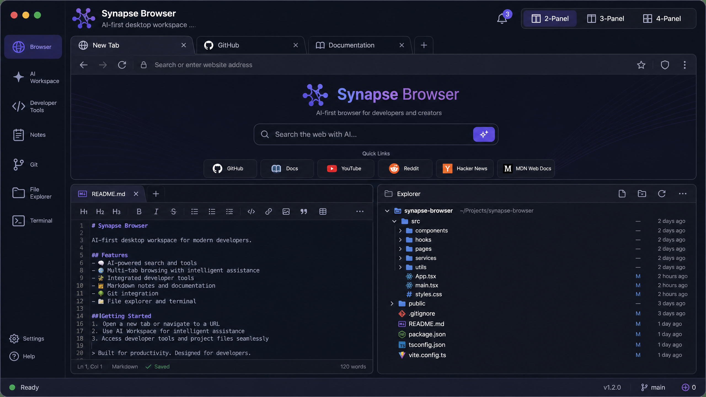
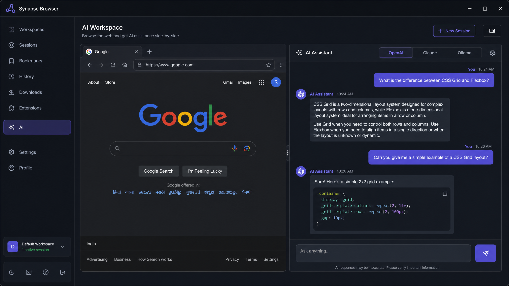
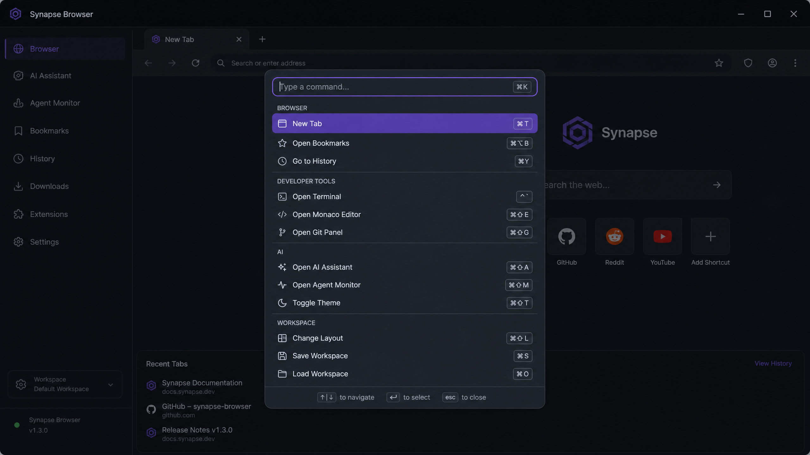
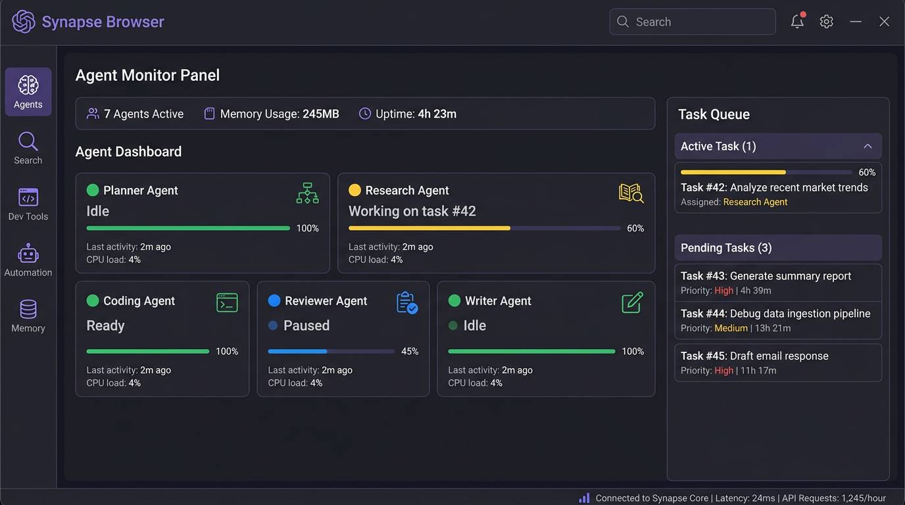
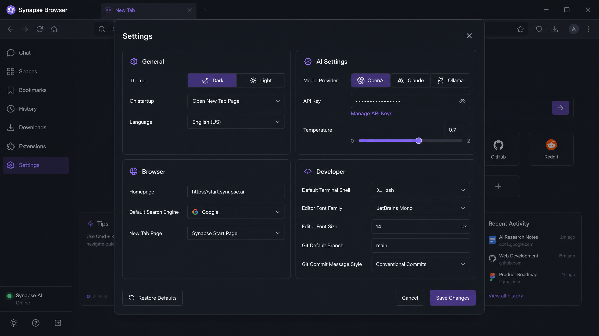

# Synapse Browser v1.0.0

> **Tell your browser what to do. Synapse does it.**

Synapse Browser is a Windows desktop browser with an integrated AI workspace. Use natural-language commands to work with the web, keep browsing sessions organized, and access AI assistance beside the active page.

This repository is intentionally scoped to the **v1.0.0 Windows release**. Later cross-platform packaging, later-release documentation, and unrelated generated assets are not part of this tree.

## v1 release gallery

These are the screenshots shipped with the `v1.0.0` release source. They show the product surface that this repository preserves.

| Main browser workspace | AI workspace |
| --- | --- |
|  |  |
| *Tabbed browsing, quick links, editor, and file explorer in one desktop workspace.* | *Browse the web beside an AI assistant and start a new session.* |

| Command palette | Agent monitor |
| --- | --- |
|  |  |
| *Search and invoke browser workspace commands.* | *Inspect agent activity and task progress.* |

| Settings | |
| --- | --- |
|  | |
| *Configure the v1 desktop workspace.* | |

## Included v1 surfaces

The v1 source includes a Chromium-based browser view with tabs, navigation controls, address-bar search, bookmarks, history, downloads, sessions, and workspace panels. The desktop shell also includes an AI workspace, command palette, notes, developer tools, terminal, file explorer, Git tools, settings, and agent-monitoring surfaces.

The v1 source includes agent and tool runtime code for browser interaction, planning, research, coding, terminal, file-system, and workspace workflows. Actual behavior depends on the configured AI provider, the target website, network access, and the permissions available to the application.

## Download the Windows release

Download the installer from the [Synapse Browser v1.0.0 release](https://github.com/Rahulrachu/synapse-browser/releases/tag/v1.0.0):

[**Synapse-Browser-1.0-Windows-x64-Setup.exe**](https://github.com/Rahulrachu/synapse-browser/releases/download/v1.0.0/Synapse-Browser-1.0-Windows-x64-Setup.exe)

## Build the Windows application

The v1 package requires Node.js and npm. From a Windows development terminal:

```powershell
git clone --branch v1.0.0 https://github.com/Rahulrachu/synapse-browser.git
cd synapse-browser
npm install
npm run dev
```

Create the production Windows package with:

```powershell
npm run build
npm run pack
```

The v1 packaging configuration produces the Windows installer and portable application targets defined in `package.json`.

## Test

Run the v1 test suite with:

```powershell
npm test -- --run
```

## Project structure

| Path | Purpose |
| --- | --- |
| `src/main/` | Desktop process, browser management, AI services, agent runtime, and workspace services. |
| `src/renderer/` | Browser shell, AI workspace, panels, stores, and user interface. |
| `src/agents/` and `src/engine/` | Agent planning and execution layers. |
| `src/tools/` | Browser, file-system, terminal, and other agent tools. |
| `tests/` | v1 engine and integration tests. |
| `docs/screenshots/` | Screenshots retained from the v1.0.0 release source. |

## License

MIT License. See [LICENSE](LICENSE).
