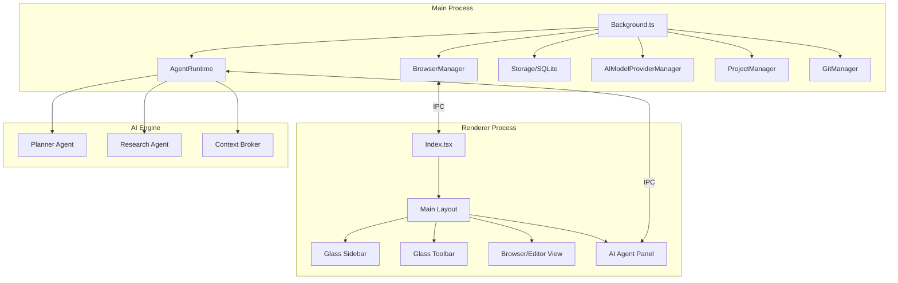

# Synapse Browser — Engineering Audit Report

## 1. Executive Summary
The current state of the Synapse Browser repository is **highly incomplete and architecturally broken**. While a basic Electron-Vite build pipeline is functional, the core application logic is largely missing or consists of placeholder code referencing non-existent modules. The visual interface is a bare-bones placeholder that does not reflect the "macOS Liquid Glass" vision.

## 2. Technical Audit Findings

### 2.1 Core Architecture (Main Process)
*   **Broken References:** `src/main/background.ts` contains dozens of IPC handlers referencing classes that do not exist in the source tree, including:
    *   `ProjectScaffoldService`
    *   `SessionManager`
    *   `TabGroupManager`
    *   `PanelManager`
    *   `ProjectManager`
    *   `GitManager`
    *   `ContextEngine`
*   **Incomplete Logic:** The `BrowserManager` and `AgentRuntime` exist but are likely stubs or partial implementations.
*   **Security:** Terminal execution handlers have extremely primitive sanitization that is insufficient for a production-grade application.

### 2.2 Frontend (Renderer Process)
*   **Placeholder Entry Point:** `src/renderer/index.tsx` only renders a single `<h1>` tag.
*   **Unused Components:** Several components exist in `src/renderer/components/` (e.g., `AIWorkspacePanel`, `AIChatPanel`) but are not imported or used anywhere.
*   **Design System:** There is no implementation of the requested "Liquid Glass" design. The project uses Tailwind CSS but lacks a defined theme or component library for the target aesthetic.

### 2.3 Configuration & Tooling
*   **Missing TypeScript Config:** There is no `tsconfig.json` in the root, leading to inconsistent type checking and build behavior.
*   **Missing Documentation:** No `README.md` or internal documentation exists.
*   **Dependency Audit:** `package.json` includes modern dependencies (React 19, Tailwind 4, Framer Motion), but many are not utilized.

## 3. Architecture Map (Target)

## 4. Immediate Action Items
1.  **Initialize Configuration:** Create `tsconfig.json` and a proper `README.md`.
2.  **Repair Main Process:** Implement or stub the missing Manager classes to fix build/runtime references.
3.  **Implement Design System:** Set up the "Liquid Glass" Tailwind configuration and base components.
4.  **Build Core Browser UI:** Implement the tab system and navigation toolbar.
5.  **Bootstrap AI Workspace:** Connect the `AIWorkspacePanel` to the `AgentRuntime`.
